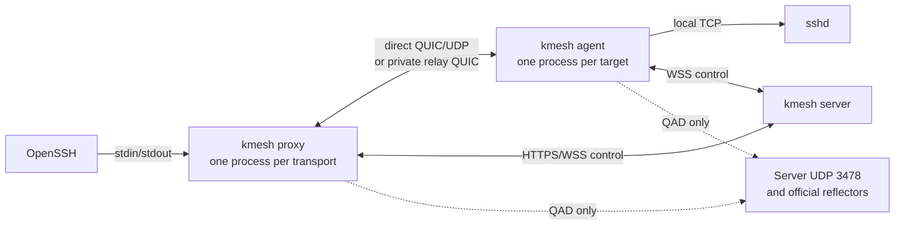

# kmesh interfaces

kmesh supplies OpenSSH with an on-demand `ProxyCommand`. OpenSSH owns SSH host-key verification, user authentication, terminals, SFTP, SCP, and port forwarding. kmesh authorizes the target, establishes one QUIC bidirectional stream, and forwards its bytes between OpenSSH and the target's local `sshd`.

The client proxy is launched for each new SSH transport. It needs no resident kmesh agent. The target runs one resident kmesh agent, but creates an isolated Iroh data endpoint for each prepared SSH session. OpenSSH `ControlMaster`/`ControlPersist` can reuse an already established SSH connection.

## API credentials

API tokens are EdDSA JWTs signed with the server's persistent user-token key. Their audience is `kmesh-api-token`, separate from the public-key access JWT audience `kmesh-user` and the tunnel-ticket audience `kmesh-tunnel`. User IDs and JWT `sub` values are normalized usernames. The fixed `system_role` values are `member` and `admin`. Access group IDs are normalized group names. Target IDs are lowercase ASCII slugs fixed at creation; target names remain editable SSH aliases. A long-lived API JWT omits `exp`; `kmesh admin tokens create <username> --label <label> --expires-in <seconds>` creates a JWT with a positive lifetime. The `jti` identifies its registered `api_tokens` row. Every HTTP request and new control WebSocket checks the signature, issuer, audience, user enabled state, token registration, token hash, revocation, and database expiry. The pending-to-active transaction repeats token and current access group checks. Revocation blocks new API requests and prevents pending SSH sessions from activating. An active SSH stream follows its normal transport lifetime.

With `[auth].method = "token"`, each command sends `KMESH_TOKEN` or `[auth].token` directly to the API and control endpoints. The environment variable takes priority. The server validates the API JWT on each request; kmesh does not copy it into local session state. This flow has no token-exchange, access-token, or refresh-token endpoint. With `[auth].method = "public-key"`, commands use the configured username and SSH key to request and sign a challenge when no valid local session exists. The client caches the short-lived access JWT and rotating refresh token by server, profile, username, and public-key fingerprint. Refresh tokens rotate under a cross-process lock. Public-key access JWTs require `sid` and `exp` and use the `kmesh-user` audience. The fingerprint scopes the local cache. It does not revoke a server session.

`GET /v1/me` returns `user_id`, `username`, `enabled`, `system_role`, and `access_groups`. Each access group includes its `group_id` and display name. Admin user views also return `system_role`. `system_role` controls administration. Access groups and their `ssh_connect` grants control SSH access.

`POST /v1/admin` requires the current database value `users.system_role = 'admin'`. A role change takes effect for the next request that uses the same token. Every admin write checks the actor role again inside its `BEGIN IMMEDIATE` transaction. The transaction also prevents the last enabled admin from losing the admin role or becoming disabled. `roles` lists the fixed platform values. `groups` creates and removes access groups. `users roles` sets one platform role. `users groups` replaces a user's access groups.

## Route selection and data paths

`GET /v1/transport` returns `TransportInfo { private_relay_url: Option<String>, qad_port: u16 }` over the authenticated HTTPS control origin. The current deployment uses TCP 9443 for HTTPS control and the private Iroh relay, and UDP 3478 for the server's QAD listener. Clients learn the private relay URL and QAD port from this response; they do not configure another STUN service.

| Attempt | QAD use | Iroh relay data | Selected path required before activation |
|---|---|---|---|
| `PrivateDirect` | The private server reflector on UDP 3478 plus one official Iroh reflector, on one retained IPv4 UDP socket | Disabled | Direct IP path |
| `PublicDirect` | The first two official Iroh QAD reflectors | Disabled | Direct IP path |
| `PrivateRelay` | None | Only the configured private relay at the authenticated server origin | That private relay URL |

When the server advertises a private relay, the client tries `PrivateDirect`, then `PublicDirect`, then `PrivateRelay`. If the server advertises no private relay, only `PublicDirect` is attempted. Official public relays provide QAD for `PublicDirect`; the direct-only endpoint has `RelayMode::Disabled`, so public relay infrastructure never carries an SSH byte stream. The final private relay endpoint uses a custom single-relay map, clears IP transports, and disables port mapping. HTTPS control and relay connections use the build-embedded mTLS identities and CA certificate.

QAD observations authenticate each reflector handshake and retain the original local UDP socket. Reflector probing has a two-second budget; stopping QAD Noq connections and joining all drivers uses the remaining route-attempt budget. The socket transfers to the next transport stage only after those drivers have stopped, so full discovery and cleanup can take longer than two seconds. The server chooses a bounded birthday-punch pairing only from observations that meet its measured preconditions: the target's two public IPv4 mappings share an IP and their ports differ by more than five, while the client's observations show one stable mapping. If discovery is unavailable or the preconditions do not match, both peers proceed with standard Iroh direct-only connection setup. The target uses up to 257 UDP sockets; the client uses its retained QAD socket and probes at most 1,000 bounded destination ports. Both sides require the same authenticated socket index before handing a selected tuple from raw UDP to Iroh.

Each connection setup has a 60-second overall deadline. Individual attempt budgets are 15 seconds for `PrivateDirect`, 15 seconds for `PublicDirect`, and 20 seconds for `PrivateRelay`. QAD reflector probing is capped at two seconds; Noq cleanup uses the remaining route-attempt budget. The signed raw-punch phase is capped at eight seconds. The server coordinates the target's probe start before the client's start. Every failed route attempt is closed and gets a fresh session ID, client data key, target data key, ticket, and RBAC check. The proxy prints each attempted mode, elapsed time, failure, and selected path to stderr.

Network and timeout failures can advance to the next configured route. Ticket, identity, RBAC, mTLS certificate, and configuration failures stop the route plan. Failure output retains the stages that actually ran; if a private relay is not configured, skipped private stages are reported as unavailable. kmesh does not retry or switch routes after SSH activation.

## Device identity, tickets, and RBAC

The enrolled target has one stable device identity. For each `Prepare { session_id, route_mode, client_endpoint_id, expires_at }`, the agent generates a fresh target data `SecretKey`. It signs a canonical payload under the `kmesh/agent-session-identity/2` domain. The payload binds the session UUID, a four-byte big-endian target-ID byte length followed by the readable target-ID bytes, route mode, target data EndpointId, and expiry. The server verifies that signature against the registered device EndpointId and binds the new data EndpointId to that pending session. The stable device private key stays on the target.

After the server accepts `AgentIdentity`, it creates the signed `TunnelTicketClaims`. The ticket binds the username, actual authentication credential reference (public-key session UUID or API-token UUID), readable target ID, client data EndpointId, per-session target data EndpointId, route mode, issuer, audience, and expiry. API JWT authentication does not create a public-key authentication session. The target writes the ticket to the client over the encrypted Iroh stream. The client and target verify the peer EndpointId against this ticket before activation.

The client JWT establishes the user identity; it does not cache target permissions. The server reads current user status, credential status, target status, access group membership, and `ssh_connect` grants when opening a session. It repeats credential and authorization checks inside the pending-to-active transaction. A later group or grant change affects new sessions and pending sessions. An activated SSH stream continues until its normal EOF, reset, or transport failure. A platform admin needs an access group grant to connect to a target.

## Control-plane sequence

1. The proxy opens `/v1/connect` with `Open { session_id, target_id, client_endpoint_id, route_mode }`. The server validates current authorization and creates a short-lived pending runtime.
2. The server sends `Prepare` to the online target agent. The agent returns its signed per-session `AgentIdentity`; the server verifies and binds it, returns `IdentityAccepted`, issues the ticket, and sends `ClientOffer` to the client.
3. For direct modes, client and target independently report `CandidatesReady`. The server either sends `ContinueNative { plan: Standard }` or pairs the two QAD result sets for bounded punching. The peers report `PunchReady` before `StartPunch`; a confirmed socket winner is handed off only after the server sends matching `ContinueNative { plan: Handoff { ... } }` messages.
4. Each peer binds its Iroh endpoint using the route policy and reports `ClientReady` or `AgentReady`. The server sends `DialOffer` to the target agent; the target initiates the Iroh connection to the client.
5. Each peer reports `PathReady { session_id, route_mode, path }` from Iroh's actual selected path. Direct modes accept only `SelectedPath::Direct`; `PrivateRelay` accepts only the configured `SelectedPath::PrivateRelay`. The target sends `IrohReady` after peer identity and the stream ticket are verified.
6. The server activates only after both path reports and target Iroh readiness match the pending session and a transactional RBAC recheck succeeds. Only then does the target connect to the local SSH address saved in agent state and start byte forwarding.

The target agent's shared device-control WSS outlives each SSH session mailbox. Finishing or closing one session mailbox ends only that session and leaves the device control channel available for later sessions.

The direct modes never include public relay URLs in peer endpoint addresses. The private relay mode never includes IP candidates. Each `PathReady` must match its route mode; the server records one path report per peer and activates once.

## Stream semantics and diagnostics

One local SSH TCP connection maps to one QUIC bidirectional stream. The adapter preserves byte order, backpressure, EOF, half-close, reset, and acknowledgement of the final bytes. The local SSH TCP socket uses `TCP_NODELAY`. On normal completion the proxy reports transferred byte counts and closes the session; on cancellation it resets the stream. `stdout` is reserved for SSH bytes. Route selection, failures, and path transitions go to `stderr`/Tracing. A bounded 4 MiB concurrent-transfer, interactive-latency, and proxy-RSS sample is recorded in the [acceptance report](../scripts/verify_iroh_live_report.md); it is one run, not an SLO or capacity estimate.

## Listeners, mTLS, and storage

`kmesh server run` serves HTTPS control and, unless `--disable-private-relay` is set, the embedded Iroh HTTP relay on the same TCP listener (default `0.0.0.0:9443`). The Iroh QAD service defaults to UDP `0.0.0.0:3478`. HTTPS control and relay connections require the CA certificate and server/client identities embedded at build time. Private TLS handshakes omit SNI. The server identity is always `DNS:kmesh.internal`, which clients validate independently of the configured `server_addr`; that address selects the network destination and HTTP host. Public QAD connections keep standard WebPKI hostname validation and SNI. The server also exposes native CLI APIs for public-key authentication, target selection, and administration.

SQLite WAL stores users, SSH public keys, access groups, group membership, grants, registered API JWTs, public-key login sessions, tunnel-session state, and `admin_audit` records. Version 0.4.1 uses the 0.4 API and schema version 6. Existing 0.4.0 databases remain compatible. Upgrades from 0.3.x or earlier require a fresh data directory; earlier schemas are not migrated. Version 0.3 clients cannot use a 0.4 server. See the root README for authentication, enrollment, service setup, and OpenSSH examples.

Local agent state is stored at `<data-dir>/agents/<target-id>/agent.json`. The selected data directory is the base, and it can contain one server binding for each target ID. Use a separate data directory for each server when target IDs are equal. Generated SSH `HostKeyAlias` values remain scoped by canonical server origin and target ID.

## Admin relay traffic

`AdminOperation::ListRelayTraffic` samples the embedded relay's actual transports twice over a one-second window. Its response reports measured elapsed milliseconds, process-lifetime ingress and egress payload totals, aggregate and per-transport bytes per second, live transport count, unique mapped SSH session count, and one row per relay endpoint transport. A session normally has two rows, one for its client endpoint and one for its per-session target endpoint. Connections without a current private-relay runtime remain visible with `metadata: null`. Totals include disconnected connections; direct UDP SSH streams never contribute.

The counters measure Iroh relay datagram payloads. Ingress includes decoded datagrams even when forwarding later fails; egress includes payloads successfully written to the destination. They exclude relay control frames, WebSocket/TLS framing, and network headers, so they differ from NIC byte counters.

`AdminOperation::CloseRelaySession { session_id }` accepts a live `PrivateRelay` session. The server commits the session as closed, disconnects all relay transports for its client and per-session target endpoints (including pending admissions), then sends `Close` over the control channels and removes runtime state. The database status check rejects subsequent relay handshakes. Direct sessions return a conflict.

## Group changes and access diagnostics

The additive `change_user_access_groups` admin operation accepts `user_id`,
`group_ids`, `mode` (`replace`, `add`, or `remove`), `dry_run`, and `expected`.
The response is `group_change`, with a `change` object, `applied`, and the current
`access_groups`. The change contains `before`, `after`, `lost_target_ids`, and
`gained_target_ids`, as well as `user_id`. A preview leaves assignments and audit
records unchanged. Current group records describe the stored assignments; `after`
describes the proposed assignments when `applied` is false.

The CLI supplies the preview as `expected` for a write. A mismatch returns HTTP
409 without a write. The server checks the actor's admin role, calculates the
change, writes assignments, and records the audit event in one immediate SQLite
transaction. Unknown groups fail before mutation. Incremental API writes without
an expected preview compute their result inside that transaction. The original
`set_user_access_groups` operation and its response remain unchanged.

The additive `explain_access` admin operation accepts a user ID and target ID.
It returns `access_explanation`: memberships, granting groups, permission blockers,
`authorized`, and `online`. Account and grant data use one database snapshot.
Agent online state is observed separately. The operation never issues credentials
or changes grants. A nonexistent user returns HTTP 404. Missing or removed targets
have a `target_unavailable` blocker. Ordinary users cannot call this admin operation.

`status` uses the existing transport and identity endpoints. Ordinary-user `doctor`
uses the existing authorized target list; it does not reveal hidden target state.
The active doctor probe uses the same route setup and activation checks as the SSH
proxy. It reads at most 8192 bytes, with lines limited to 255 bytes, to find a valid
SSH 2.0 or 1.99 identification within 12 seconds. It resets the stream, sends a
session close, and closes its endpoint on both successful and failed banner checks.
It does not send SSH authentication data or verify the SSH host key.
