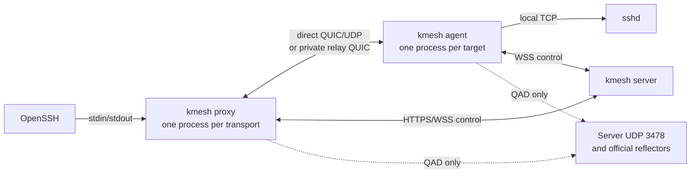

# kmesh interfaces

kmesh supplies OpenSSH with an on-demand `ProxyCommand`. OpenSSH owns SSH host-key verification, user authentication, terminals, SFTP, SCP, and port forwarding. kmesh authorizes the target, establishes one QUIC bidirectional stream, and forwards its bytes between OpenSSH and the target's local `sshd`.

The client proxy is launched for each new SSH transport. It needs no resident kmesh agent. The target runs one resident kmesh agent, but creates an isolated Iroh data endpoint for each prepared SSH session. OpenSSH `ControlMaster`/`ControlPersist` can reuse an already established SSH connection.

## Route selection and data paths

`GET /v1/transport` returns `TransportInfo { private_relay_url: Option<String>, qad_port: u16 }` over the authenticated HTTPS control origin. The current deployment uses TCP 9443 for HTTPS control and the private Iroh relay, and UDP 3478 for the server's QAD listener. Clients learn the private relay URL and QAD port from this response; they do not configure another STUN service.

| Attempt | QAD use | Iroh relay data | Selected path required before activation |
|---|---|---|---|
| `PrivateDirect` | The private server reflector on UDP 3478 plus one official Iroh reflector, on one retained IPv4 UDP socket | Disabled | Direct IP path |
| `PublicDirect` | The first two official Iroh QAD reflectors | Disabled | Direct IP path |
| `PrivateRelay` | None | Only the configured private relay at the authenticated server origin | That private relay URL |

When the server advertises a private relay, the client tries `PrivateDirect`, then `PublicDirect`, then `PrivateRelay`. If the server advertises no private relay, only `PublicDirect` is attempted. Official public relays provide QAD for `PublicDirect`; the direct-only endpoint has `RelayMode::Disabled`, so public relay infrastructure never carries an SSH byte stream. The final private relay endpoint uses a custom single-relay map, clears IP transports, and disables port mapping. HTTPS relay connections use the configured CA certificates.

QAD observations authenticate each reflector handshake and retain the original local UDP socket. Reflector probing has a two-second budget; stopping QAD Noq connections and joining all drivers uses the remaining route-attempt budget. The socket transfers to the next transport stage only after those drivers have stopped, so full discovery and cleanup can take longer than two seconds. The server chooses a bounded birthday-punch pairing only from observations that meet its measured preconditions: the target's two public IPv4 mappings share an IP and their ports differ by more than five, while the client's observations show one stable mapping. If discovery is unavailable or the preconditions do not match, both peers proceed with standard Iroh direct-only connection setup. The target uses up to 257 UDP sockets; the client uses its retained QAD socket and probes at most 1,000 bounded destination ports. Both sides require the same authenticated socket index before handing a selected tuple from raw UDP to Iroh.

Each connection setup has a 60-second overall deadline. Individual attempt budgets are 15 seconds for `PrivateDirect`, 15 seconds for `PublicDirect`, and 20 seconds for `PrivateRelay`. QAD reflector probing is capped at two seconds; Noq cleanup uses the remaining route-attempt budget. The signed raw-punch phase is capped at eight seconds. The server coordinates the target's probe start before the client's start. Every failed route attempt is closed and gets a fresh session ID, client data key, target data key, ticket, and RBAC check. The proxy prints each attempted mode, elapsed time, failure, and selected path to stderr.

Network and timeout failures can advance to the next configured route. Ticket, identity, RBAC, TLS/CA, and configuration failures stop the route plan. Failure output retains the stages that actually ran; if a private relay is not configured, skipped private stages are reported as unavailable. kmesh does not retry or switch routes after SSH activation.

## Device identity, tickets, and RBAC

The enrolled target has one stable device identity. For each `Prepare { session_id, route_mode, client_endpoint_id, expires_at }`, the agent generates a fresh target data `SecretKey`. It signs a canonical payload binding the session ID, target UUID, route mode, target data EndpointId, and expiry with the stable device key. The server verifies that signature against the registered device EndpointId and binds the new data EndpointId to that pending session. The stable device private key stays on the target.

After the server accepts `AgentIdentity`, it creates the signed `TunnelTicketClaims`. The ticket binds the user and login session, target UUID, client data EndpointId, per-session target data EndpointId, route mode, issuer, audience, and expiry. The target writes the ticket to the client over the encrypted Iroh stream. The client and target verify the peer EndpointId against this ticket before activation.

The client JWT establishes the user identity; it does not cache target permissions. The server reads current user status, login-session status, target status, role bindings, and `ssh_connect` grants when opening a session. It repeats authorization inside the pending-to-active transaction. A later role or permission change affects new sessions; an activated SSH stream continues until its normal EOF, reset, or transport failure.

## Control-plane sequence

1. The proxy opens `/v1/connect` with `Open { session_id, target_id, client_endpoint_id, route_mode }`. The server validates current authorization and creates a short-lived pending runtime.
2. The server sends `Prepare` to the online target agent. The agent returns its signed per-session `AgentIdentity`; the server verifies and binds it, returns `IdentityAccepted`, issues the ticket, and sends `ClientOffer` to the client.
3. For direct modes, client and target independently report `CandidatesReady`. The server either sends `ContinueNative { plan: Standard }` or pairs the two QAD result sets for bounded punching. The peers report `PunchReady` before `StartPunch`; a confirmed socket winner is handed off only after the server sends matching `ContinueNative { plan: Handoff { ... } }` messages.
4. Each peer binds its Iroh endpoint using the route policy and reports `ClientReady` or `AgentReady`. The server sends `DialOffer` to the target agent; the target initiates the Iroh connection to the client.
5. Each peer reports `PathReady { session_id, route_mode, path }` from Iroh's actual selected path. Direct modes accept only `SelectedPath::Direct`; `PrivateRelay` accepts only the configured `SelectedPath::PrivateRelay`. The target sends `IrohReady` after peer identity and the stream ticket are verified.
6. The server activates only after both path reports and target Iroh readiness match the pending session and a transactional RBAC recheck succeeds. Only then does the target connect to its locally configured `ssh.address` and start byte forwarding.

The target agent's shared device-control WSS outlives each SSH session mailbox. Finishing or closing one session mailbox ends only that session and leaves the device control channel available for later sessions.

The direct modes never include public relay URLs in peer endpoint addresses. The private relay mode never includes IP candidates. Each `PathReady` must match its route mode; the server records one path report per peer and activates once.

## Stream semantics and diagnostics

One local SSH TCP connection maps to one QUIC bidirectional stream. The adapter preserves byte order, backpressure, EOF, half-close, reset, and acknowledgement of the final bytes. The local SSH TCP socket uses `TCP_NODELAY`. On normal completion the proxy reports transferred byte counts and closes the session; on cancellation it resets the stream. `stdout` is reserved for SSH bytes. Route selection, failures, and path transitions go to `stderr`/Tracing. A bounded 4 MiB concurrent-transfer, interactive-latency, and proxy-RSS sample is recorded in the [acceptance report](../scripts/verify_iroh_live_report.md); it is one run, not an SLO or capacity estimate.

## Listeners, TLS, and storage

`kmesh server run` serves HTTPS control and, unless `--disable-private-relay` is set, the embedded Iroh HTTP relay on the same TCP listener (default `0.0.0.0:9443`). The Iroh QAD service defaults to UDP `0.0.0.0:3478`. A deployment certificate for the server origin covers HTTPS control, relay WSS, and QAD TLS name verification. The server also exposes native CLI APIs for login, target selection, and administration.

SQLite WAL stores users, SSH public keys, roles, grants, targets, login sessions, tunnel-session state, and `admin_audit` records. The current schema requires a fresh data directory; earlier STUN/Quinn/WSS-data databases are not migrated. See the root README for login, enrollment, service setup, and OpenSSH examples.
